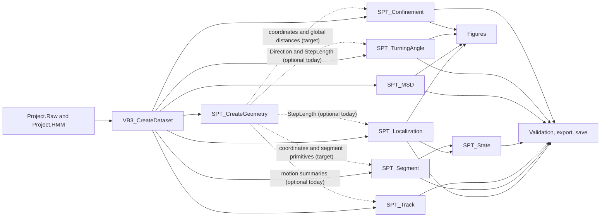

# VB3 Companion Toolbox v5 analysis baseline plan

## Scope

This plan freezes the current v4.2 Analysis behavior before refactoring. Public
function signatures and consumer-visible fields in `Project.Tables`,
`Project.Analysis`, `Project.Geometry`, and `Project.Figures` are compatibility
contracts. MATLAB R2016b remains the minimum runtime.

The regression gate is `tests/regression/VB3_RunRegressionBaseline.m`. Capture
must be run with the documented known-good Cell4 group02 pair on the validated
R2016b workstation, before using `verify` as a release gate.

## Current architecture

The current pipeline order is:

```text
VB3_ReadProject
  -> VB3_CreateDataset
  -> SPT_CreateGeometry
  -> SPT_Localization
  -> SPT_Segment
  -> SPT_Track
  -> SPT_State
  -> Transition analysis
  -> SPT_MSD
  -> SPT_TurningAngle
  -> SPT_Confinement
  -> SPT_Figures
  -> save, CSV export, report
```

Analysis data is physically split across three locations:

| Location | Current responsibility |
|---|---|
| `Project.Geometry` | Coordinates and whole-trajectory motion primitives |
| `Project.Tables` | Localization, Segment, Track, and State tabular views |
| `Project.Analysis` | Transition, MSD, TurningAngle, and Confinement results |

`SPT_Validation`, the save/export functions, and all Figure modules are downstream
contract consumers. They should not be changed merely to accommodate an Analysis
refactor.

## Dependency graph



Solid arrows are required data flow. Dashed arrows are optional/fallback use in
the current implementation. A v5 refactor should make validated Geometry the
canonical source while retaining all existing output locations.

The RC002 dependency audit found that `SPT_Localization`, `SPT_Track`, and
`SPT_TurningAngle` already read Geometry but still permit missing-field or
missing-layer fallbacks. `SPT_Segment` recomputes coordinates, step length,
velocity, and direction, while `SPT_Confinement` recomputes coordinates and
whole-trajectory step/cumulative/net displacement. Those whole-trajectory paths
must become required Geometry consumers before `SPT_CreateGeometry` can be the
only provider. Confinement's sliding-window distances remain local analysis
metrics rather than duplicates of whole-trajectory Geometry fields. Removing
these downstream paths requires edits to those modules and is therefore outside
the source-file scope of RC002.

## Frozen current semantics

These statements describe v4.2 behavior, including inconsistencies. Changing one
requires an explicit expected-baseline update.

### Duration

- Localization frames are one-based; Localization time is zero-based:
  `Time = (Frame - 1) * dt`.
- Segment sets `Duration_s = NPoints * dt`.
- Segment `StartTime_s` and `EndTime_s` are point timestamps, so their difference
  is `(NPoints - 1) * dt`. It therefore does not equal Segment `Duration_s`.
- Track sets `Duration_s = (NPoints - 1) * dt`.
- Confinement window center time is `(WindowCenterFrame - 1) * dt`.

No duration definition is corrected in the baseline change.

### Step-to-frame ownership

Geometry produces `NPoints - 1` steps from `diff(X)` and `diff(Y)`. Localization
copies these values into rows `1:NPoints-1`, leaving the last row `NaN`. Thus the
current table assigns a step to its start frame: row `j` owns motion from point
`j` to point `j+1`.

State step summaries inherit this convention because they select Localization
`StepLength` using the state on the same row.

### Turning-angle state and time alignment

- A turning angle is calculated as `diff(Direction)` at the vertex between two
  consecutive steps.
- The first angle is reported at `Frame = 2`.
- v4.2 reports `Time_s = Frame * dt`, which is one `dt` later than Localization's
  timestamp for the same frame.
- `State = state(1:nAngles)`. The first turn is therefore labeled with the state
  stored for the first/preceding step, not explicitly with the vertex or following
  step state.
- `Config.TurningAngle.MinPoints` is stored in the result but is not used as the
  acceptance threshold; the code accepts any trajectory that yields two steps.

### Finite-coordinate handling

- Dataset validation checks numeric shape but does not require finite X/Y values.
- Geometry keeps coordinates unchanged. `diff`, centroid means, distance sums,
  and endpoint displacement naturally propagate `NaN`/`Inf` according to MATLAB
  arithmetic. Geometry's summary helpers remove `NaN` but do not remove `Inf`.
- MSD does not filter invalid displacement pairs before counting and pooling them;
  one invalid coordinate can therefore contaminate affected lag sums.
- Segment and Track means similarly do not impose a shared finite-coordinate
  policy.
- Confinement removes `NaN` state labels for mode calculations, but coordinate
  geometry is computed from the supplied coordinates without a common finite
  filter.

This behavior is frozen for regression only; v5 should adopt one documented
finite-pair policy.

### State-count inference

- `SPT_Localization` requires `Project.HMM.nStates >= 1` and treats it as
  authoritative.
- Segment, Track, State, TurningAngle, Confinement, Transition, Validation, and
  Figure code each contain local inference paths.
- Where available and positive, `Project.HMM.nStates` is generally preferred.
  Fallback paths infer the maximum observed non-NaN state, with a minimum of one
  in several callers.
- Dynamic output names remain `pStateN`, `meanPStateN`, and
  `stateN_fraction`.

The baseline does not consolidate inference; v5 should establish one policy.

## Reusable modules

- `SPT_CreateGeometry`: retain its signature and current fields; use it as the
  canonical trajectory-primitive cache.
- `SPT_Localization`: retain identity columns, frame/time convention, posterior
  columns, sorting, and public table location.
- `SPT_Segment`: retain contiguous-state boundary detection and table contract.
- `SPT_Track`: retain one-row-per-track intent, state fractions, switch count,
  dominant state, and geometry summaries.
- `SPT_State`: retain state occupancy, dwell, segment, and track aggregation
  columns.
- `SPT_MSD`: retain its lag loop, pair-pooled ensemble, trajectory mean/SEM, and
  linear/power-law fit result shape. This is the cleanest independent core.
- `SPT_TurningAngle`: retain wrapped-angle, histogram, circular summary,
  `PerTrajectory`, `Table`, `Ensemble`, `ByState`, and `Summary` contracts.
- `SPT_Confinement`: retain its sliding windows, trajectory table, window table,
  profiles, ensemble, and state summary contracts.
- Figure modules and utilities: reuse as read-only consumers and R2016b
  compatibility helpers.

## Modules to refactor

| Priority | File | Target |
|---|---|---|
| P0 | Regression harness | Capture current Cell4 output before semantic changes. |
| P1 | `SPT_CreateGeometry.m` | Canonical X/Y, DX/DY, displacement, step, direction, velocity, acceleration, time, and distance provider. |
| P1 | `SPT_Localization.m` | Shared alignment and posterior normalization; preserve outgoing-step ownership until migration is approved. |
| P1 | `SPT_Segment.m` | Reuse canonical primitives and resolve duration semantics through an explicit compatibility decision. |
| P1 | `SPT_Track.m` | Consume Geometry deterministically and preserve a row for every Dataset trajectory. |
| P2 | `SPT_State.m` | Resolve unavailable Localization velocity and stop asserting Statistics ownership. |
| P2 | `SPT_TurningAngle.m` | Enforce configuration and resolve vertex time/state semantics. |
| P2 | `SPT_MSD.m` | Validate configuration and filter finite coordinate pairs under a documented rule. |
| P3 | `SPT_Confinement.m` | Reuse global Geometry, honor configuration switches, and populate real window state fractions. |
| P3 | `VB3_ProjectSchema.m` | Synchronize declared Geometry and Validation fields with actual outputs. |

## Modules to retire

No public module should be retired at baseline. Pipeline calls, exports,
validation, and Figures rely on every requested entry point.

After equivalence is proven, retire only duplicated private paths:

- repeated whole-trajectory X/Y, step, direction, velocity, and distance helpers;
- one of the duplicate posterior-orientation implementations;
- repeated local `nStates` inference;
- repeated circular-statistics helpers within Analysis;
- the unused `VB3_StateEngine` result in Localization;
- fallback geometry recomputation after Geometry becomes a validated prerequisite;
- ignored configuration branches only after implementation or a documented
  deprecation period.

`SPT_PlotTrajectory.m` is a legacy figure path, but retirement is outside the
Analysis baseline scope.

## Recommended implementation order

1. Run `VB3_RunRegressionBaseline('capture')` on the known-good Cell4 pair with
   MATLAB R2016b and preserve the MAT/text manifests.
2. Confirm the captured baseline includes validation success, all four tables,
   Transition/MSD/TurningAngle/Confinement, and expected CSV/Figure files.
3. Add focused semantic cases for one-, two-, and three-point tracks, a state
   boundary, transposed/missing posterior, invalid coordinates, and N-state data.
4. Canonicalize `SPT_CreateGeometry` without changing its signature or existing
   values. Verify immediately against the Cell4 capture.
5. Refactor Localization, then Segment, then Track.
6. Refactor State after point and segment semantics are stable.
7. Refactor TurningAngle, then harden MSD.
8. Refactor Confinement last because it has the widest result/Figure contract.
9. Synchronize schema declarations only after runtime fields are stable.
10. After every module, run the R2016b baseline, validation, Figure generation,
    CSV/export/save checks, then the documented five-pair batch gate.

Do not implement `SPT_Kinematics_Step.m` during this baseline task.
